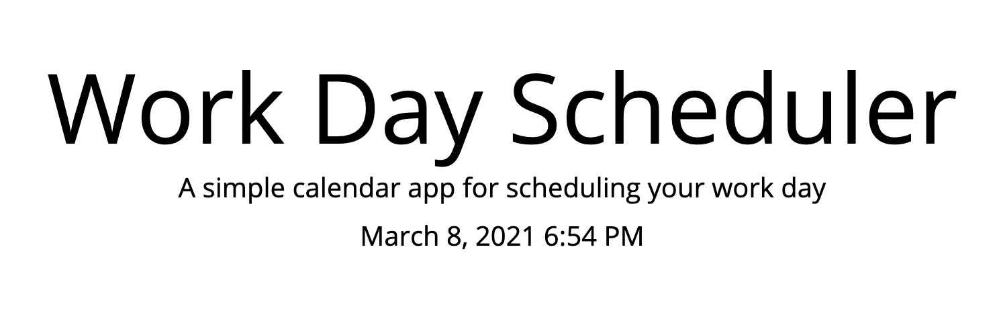
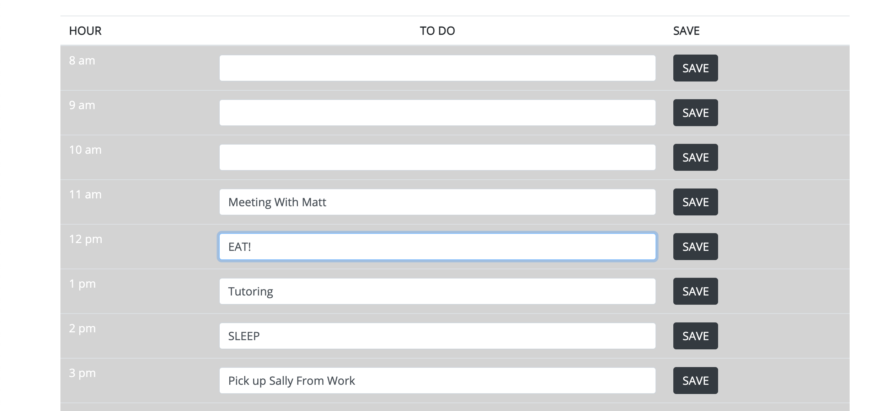

# Daily Calendar

## The Repository 
This Repository is where Ian Fletcher's Daily Calendar App.

## Installation
In order to acess and refractor the code you must first go through the Installation Process.

1) Open GitHub and navigate to the main repository 

2) Click the green "Code" button Above the top right corner of the files 

3) To clone the repository using HTTPS, under "Clone with HTTPS", click the clipboard icon. To clone the repository using an SSH key, including a certificate issued by your organization's SSH certificate authority, click "Use SSH", then click the clipboard icon. To clone a repository using GitHub CLI, click "Use GitHub CLI", then click the clipboard icon.

4) Open Terminal and navigate to the directory where you want the repository to be 

5) Type "git clone ", and then paste the SSH, CLI, or HTTPS link you coppied on GitHub and press ENTER 

This should put a copy of the repository into the directory you had chosen in step 1

## Usage
This application allows users to save lists of tasks, meetings or anything else into hour long blocks for each hour of the work day. When information is entered into the text fields the user can save the information by pressing the save button. If the page is refreshed, the application will remember what was saved and keeps each item in its respective hour slot. The application also lets you know where you are on your list by color coding each time block. All past hour blocks are colored grey, the present hour block is colored red, and future hour blocks are colored green. The current date and time is displayed at the top of the page for reference.

[Check Out The Full Page](https://ianfletcher314.github.io/DailyCalendar/)

## Credits

- [GitHub's Document on Cloning Repositories (used in Instalation section)](https://docs.github.com/en/github/creating-cloning-and-archiving-repositories/cloning-a-repository) 
- [VS Code's ReadMe Page (used for formating and licensing syntax)](https://github.com/microsoft/vscode/blob/master/README.md)

## License 

Copyright (c) Horision SSS Inc. All Rights Reserved.

Licensed under the [MIT](license.txt) license
